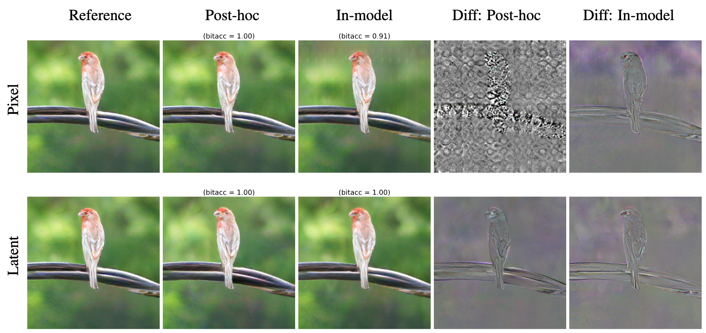

<div align="center">

# 🎥 🦭 DistSeal: Learning to Watermark in Latent Space
</div>

<div>
Official implementation of DistSeal, a unified framework for latent watermarking that works across both diffusion and autoregressive models. In the 🚀 Usage sections, we show examples of in-model watermarking and post-hoc latent watermarking for the diffusion model DC-AE and the autoregressive model RAR. We provide the model checkpoints from the paper, as well as the training code to reproduce them.
<br><br>

[ [Colab](https://colab.research.google.com/github/facebookresearch/distseal/blob/main/notebooks/colab.ipynb) ]
[ [Arxiv](https://arxiv.org/abs/2601.16140) ]
[ [Blog](https://ai.meta.com/research/publications/distilling-latent-space-watermarkers-into-generative-image-models/) ]
[ [Meta Seal](https://facebookresearch.github.io/meta-seal/) ]
</div>
<p align="center">
    
    <br/>
</p>


# 💿 Installation

First, set up a conda environment. DistSeal is developed using Pytorch, and it is advised to install the matching torch that supports your CUDA version for optimized performance. In this example, we install torch 27.1+cu128.

```bash
conda create --name distseal python=3.10 pip
conda activate distseal

pip install torch==2.7.1 torchvision==0.22.1 torchaudio==2.7.1 --index-url https://download.pytorch.org/whl/cu126
```

Then, clone the repository and install the necessary libraries:

```bash
git clone https://github.com/facebookresearch/distseal
cd distseal

python -m pip install -e .
```

<br>

Before running the code below, ensure to add the `deps` to your system path:

```shell
# If set within distseal/

export PYTHONPATH=${PYTHONPATH}:deps
```

# 🚀 Usage: in-model watermarking

With DistSeal, we propose two ways to do in-model watermarking: the post-hoc latent watermarker can be distilled in the generator (diffusion or autoregressive) or in the latent decoder. We give examples below for RAR-XL and DC-AE where one can choose to use in-model watermarking either in the generator by specifying `in_model_type = "generator"` or in the latent_decoder by specifying `in_model_type = "latent_decoder"`.


### 1️⃣ Autoregressive Models

```python
import matplotlib.pyplot as plt
import torch
import torchvision.transforms as T

from distseal.utils.metrics import message_accuracy
from distseal.loader import load_generator, load_decoder, load_detector

device = "cuda"

# Choose to use RAR distilled generator or the distilled latent decoder.
in_model_type = "generator"  # "generator" or "latent_decoder"

if in_model_type == "generator":
    generator = load_generator("rar_xl_distseal.yaml", device=device)
    tokenizer = load_decoder("maskgit_base.yaml", device=device)
    detector_yaml = "detector_rar.yaml"
elif in_model_type == "latent_decoder":
    generator = load_generator("rar_xl_base.yaml", device=device)
    tokenizer = load_decoder("maskgit_distseal_postquant.yaml", device=device)
    detector_yaml = "detector_maskgit_postquant.yaml"

# Generate images from ImageNet classes.
labels = [torch.tensor(v) for v in [330, 12, 387, 437, 938, 978]]
labels = torch.LongTensor(labels).to(device)

tokens = generator.generate(
    labels,
    guidance_scale=4.0,
    guidance_decay="constant",
    guidance_scale_pow=0.0,
    randomize_temperature=0.0,
    softmax_temperature_annealing=False,
)

# Decode the sequences of tokens into images.
images = tokenizer.decode(tokens)
images = (torch.clamp(images, 0.0, 1.0) * 255.0).to(dtype=torch.uint8).cpu()

# Visualize the images.
fig, axes = plt.subplots(2, 3, figsize=(12, 8))
axes = axes.flatten()

for idx, img in enumerate(images):
    axes[idx].imshow(img.permute(1, 2, 0).numpy())
    axes[idx].axis('off')
    axes[idx].set_title(f'Image {idx}')

plt.tight_layout()
plt.show()


# To detect watermarks from images, download the extractor and the message,
# then feed images in tensor format with values between 0 and 1. For RAR-XL,
# 256x256 images are expected.
detector, secret_msg = load_detector(detector_yaml, device=device)

msg_pred = detector.detect_watermark(images.to(device) / 255.0)
msg_gt = secret_msg.repeat((msg_pred.shape[0], 1))
bit_acc = message_accuracy(secret_msg, msg_pred)
print(f"Average bit accuracy: {bit_acc * 100:.2f}%")
```

### 2️⃣ Diffusion Models

```python

import matplotlib.pyplot as plt
import torch
import torchvision.transforms as T

from distseal.utils.metrics import message_accuracy
from distseal.loader import load_generator, load_decoder, load_detector

device = "cuda"
in_model_type = "generator"  # "generator" or "latent_decoder"

if in_model_type == "generator":
    generator = load_generator("uvit-h_distseal.yaml", device=device)
    autoencoder = load_decoder("dc-ae-f64c128_base.yaml", device=device)
    detector_yaml = "detector_dc-ae.yaml"
elif in_model_type == "latent_decoder":
    generator = load_generator("uvit-h_base.yaml", device=device)
    autoencoder = load_decoder("dc-ae-f64c128_distseal.yaml", device=device)
    detector_yaml = "detector_dc-ae.yaml"

# Generate images from ImageNet classes
labels = [torch.tensor(v) for v in [330, 12, 387, 437, 938, 978]]
labels = torch.IntTensor(labels).to(device)

prompts_null = 1000 * torch.ones((labels.shape[0],), dtype=torch.int, device=device)

latent_samples = generator.generate(
    labels,
    prompts_null,
    scale=6.0,
)
latent_samples = latent_samples / 0.2889

# Decode the latents into images.
images =  autoencoder.decode(latent_samples)
images = torch.clamp(127.5 * images + 128.0, 0, 255).to(dtype=torch.uint8).cpu()

# Visualize the images.
fig, axes = plt.subplots(2, 3, figsize=(12, 8))
axes = axes.flatten()

for idx, img in enumerate(images):
    axes[idx].imshow(img.permute(1, 2, 0).numpy())
    axes[idx].axis('off')
    axes[idx].set_title(f'Image {idx}')

plt.tight_layout()
plt.show()


# To detect watermarks from images, download the extractor and the message,
# then feed images in tensor format with values between 0 and 1. For DC-AE,
# 512x512 images are expected.
detector, secret_msg = load_detector(detector_yaml, device=device)

msg_pred = detector.detect_watermark(images.to(device) / 255.0)
msg_gt = secret_msg.repeat((msg_pred.shape[0], 1))
bit_acc = message_accuracy(secret_msg, msg_pred)
print(f"Average bit accuracy: {bit_acc * 100:.2f}%")
```

# 🚀 Usage: post-hoc latent watermarking
We also provide notebooks for RAR ([`notebooks/posthoc_rar.ipynb`](./notebooks/posthoc_rar.ipynb)) and DCAE ([`notebooks/posthoc_dcae.ipynb`](./notebooks/posthoc_dcae.ipynb)) illustrating post-hoc latent watermarking on an example image. The latent encoder first encodes the loaded image into latents which are watermarked by the post-hoc latent watermarker. We visualize the watermarked image by decoding the watermarked latents back to the pixel space, and then detect the watermark from the final image.


# 📇 Model Cards

For each setting, we have a generative model composed of a generator (autoregressive or diffusion) and a latent decoder, along with a watermark detector to extract the message from the generated images. In the table below, each row provides a triplet of generator/latent decoder/watermark detector that work together. As with DistSeal, either the generator or the latent decoder is watermarked, the 🔐 icon indicates which component contains the in-model watermark. **NB:** the detector model cards contain both the embedder and the extractor of each post-hoc latent watermarker.


<div style="overflow-x: auto;">
<table style="white-space: nowrap;">
    <thead>
        <tr>
            <th>Method</th>
            <th>Watermarked Step</th>
            <th>Generator</th>
            <th>Latent decoder</th>
            <th>Detector</th>
        </tr>
    </thead>
    <tbody>
        <tr>
            <td>RAR</td>
            <td>Transformer</td>
            <td>🔐 <a href="./cards/rar_xl_distseal.yaml">rar_xl_distseal</a></td>
            <td><a href="./cards/maskgit_base.yaml">maskgit_base</a></td>
            <td><a href="./cards/detector_rar.yaml">detector_rar</a></td>
        </tr>
        <tr>
            <td>RAR</td>
            <td>Latent decoder <br> (before quantization)</td>
            <td><a href="./cards/rar_xl_base.yaml">rar_xl_base</a></td>
            <td>🔐 <a href="./cards/maskgit_distseal_prequant.yaml">maskgit_distseal_prequant</a></td>
            <td><a href="./cards/detector_maskgit_prequant.yaml">detector_maskgit_prequant</a></td>
        </tr>
        <tr> 
            <td>RAR</td>
            <td>Latent decoder <br> (after quantization)</td>
            <td><a href="./cards/rar_xl_base.yaml">rar_xl_base</a></td>
            <td>🔐 <a href="./cards/maskgit_distseal_postquant.yaml">maskgit_distseal_postquant</a></td>
            <td><a href="./cards/detector_maskgit_postquant.yaml">detector_maskgit_postquant</a></td>
        </tr>
        <tr>
            <td>DC-AE</td>
            <td>Diffusion model</td>
            <td>🔐 <a href="./cards/uvit-h_distseal.yaml">uvit-h_distseal</a></td>
            <td><a href="./cards/dc-ae-f64c128_base.yaml">dc-ae-f64c128_base</a></td>
            <td><a href="./cards/detector_dc-ae.yaml">detector_dc-ae</a></td>
        </tr>
        <tr>
            <td>DC-AE</td>
            <td>Latent decoder</td>
            <td><a href="./cards/uvit-h_base.yaml">uvit-h_base</a></td>
            <td>🔐 <a href="./cards/dc-ae-f64c128_distseal.yaml">dc-ae-f64c128_distseal</a></td>
            <td><a href="./cards/detector_dc-ae.yaml">detector_dc-ae</a></td>
        </tr>
    </tbody>
    </table>
</div>

<br>

# 📈  Running the experiments

## 🔦 Evaluations

### Step 1: Generate Samples

For evaluation we generate 50,000 images conditioned on ImageNet-1K classes. We provide both scripts 
for autoregressive and diffusion models. Below we provide the examples to generate images from the distilled transformers of DCAE and RAR-XL.
If instead, you would like to use the distilled latent decoders, simply change the model cards to the corresponding ones from the table above.


To generate 50K images with distilled RAR-XL:

```bash
torchrun --nnodes=1 --nproc_per_node=8 scripts/sample_imagenet_rar.py \
    config=configs/generation/rar.yaml \
    experiment.generator_card=cards/rar_xl_distseal.yaml \
    experiment.decoder_card=cards/maskgit_base.yaml \
    experiment.output_dir="distilled_rar_xl/gen_50k" \
    model.generator.samples_per_class=50 \
    model.generator.randomize_temperature=1.02 \
    model.generator.guidance_scale=6.9 \
    model.generator.guidance_scale_pow=1.5
```

To generate 50K images with distilled DC-AE diffusion:

```bash
torchrun --nnodes=1 --nproc_per_node=8 scripts/sample_imagenet_dcae.py \
    diffusion_model=cards/uvit-h_distseal.yaml \
    autoencoder_model=cards/dc-ae-f64c128_base.yaml \
    samples_dir="distilled_dcae/gen_50k" \
    samples_per_class=50 \
    batch_size=16 \
    guidance_scale=1 \
    scaling_factor=0.2889
```


### Step 2: Computing quality metrics (FID) 

For each set of 50K generated samples, we use [`torch-fidelity`](https://github.com/toshas/torch-fidelity) to compute the FID against the 50K images of the ImageNet validation set. Note that
the FID scores might be slightly different than other related work which other reference datasets and preprocessing. 

```bash
# Download ImageNet 061417 to a local directory and refer to validation set for FID computation
export REF_DATASET=/path/to/imagenet/061417/val

# Point to the output directory of step 1
export GEN_50K_DIR=/path/to/generated_images

fidelity \
    --gpu 0 \
    --fid \
    --isc \
    --samples-find-deep \
    --samples-find-ext png,jpg,jpeg \
    --samples-resize-and-crop 299 \
    --input1 ${GEN_50K_DIR} \
    --input2 ${REF_DATASET}
```

### Step 3: Computing robustness metrics

To evaluate the model robustness (computing the bit accuracy under different attacks), we use [Omniseal Bench](https://github.com/facebookresearch/omnisealbench),
which provides a rich set of image attacks and robustness metrics. The robustness evaluation script is in "scripts/eval.py":

Ensure to choose the detector card which match the generated images (see the model cards table above).

```
pip install "git+https://github.com/facebookresearch/omnisealbench.git#egg=omnisealbench[image]"

# For RAR-XL, resolution = 256, for DC-AE, resolution = 512

torchrun --nnodes=1 --nproc_per_node=8 scripts/eval.py \
    --image_dir /path/to/generated_images \
    --result_dir output_dir \
    --detector cards/detector_rar.yaml \
    --resolution 256 \
    --attacks scripts/attacks.yaml \
    --num_samples 50000 \
```

The evaluation can take several hours to finish. If you want to have earlier results, you can reduce the value of `num_samples` or trim the attack list
`scripts/attacks.yaml`.

## 📇 Training

For detailed training instructions, please refer to [Training documentation](docs/TRAINING.md).

---


# 📜 Citation

If you find this work useful, please consider giving the repo a star ⭐ :) and citing our work:

```bitex
@article{rebuffi2025latent,
  title={Learning to Watermark in the Latent Space of Generative Models},
  author={Rebuffi, Sylvestre-Alvise and Tran, Tuan and Lacatusu, Valeriu and Fernandez, Pierre and 
          Sou\v{c}ek, Tom\'{a}\v{s} and Elsahar, Hady and Sander, Tom and Mourachko, Alexandre},
  year={2025}
}
```


<br>

# 📃 License

The model and code are licensed under [MIT license](LICENSE).

# Contributing

See [contributing](.github/CONTRIBUTING.md) and the [code of conduct](.github/CODE_OF_CONDUCT.md).


## 💚 Acknowledgements

We adapt code from other repositories:
- [VideoSeal](https://github.com/facebookresearch/videoseal/) models and modules.
- [RAR](https://github.com/bytedance/1d-tokenizer) in `deps/rar/`.
- [EfficientVIT](https://github.com/mit-han-lab/efficientvit/tree/master/efficientvit) in `deps/efficientvit/`.


## Other repositories

### Text and LLM watermarking

- Development: https://github.com/fairinternal/llamark
- Radioactive watermarking: https://github.com/facebookresearch/radioactive-watermark

### Image & Video

- Watermark Anything: https://github.com/facebookresearch/watermark-anything
- VideoSeal, PixelSeal, ChunkySeal : https://github.com/facebookresearch/videoseal


### Model watermarking

- Autoregressive Watermarking for Images: https://github.com/facebookresearch/wmar
- Stable Signature: https://github.com/facebookresearch/stable_signature
